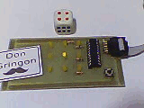
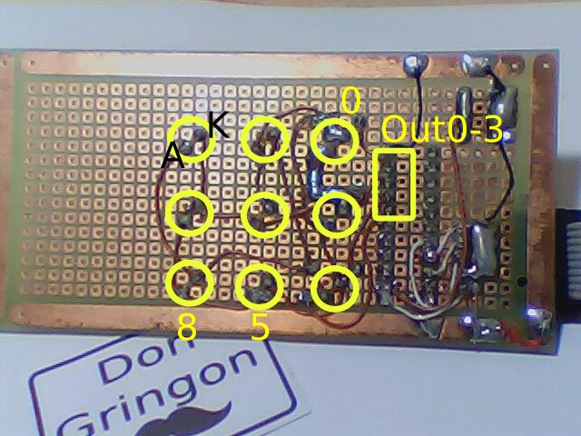

charlie dice
============

2014-02-20 
A dice game that use leds connected with charlieplex method.  
//based on http://makezine.com/projects/charlieplexing-leds-with-an-avr-atmega328-or-arduino/



Using ATtiny2313, should work with arduino, atmega etc.Just set the correct port.


```
4 pins: PD2-5, with 100R resistors
PD2: ---100R---OUT0
PD3: ---100R---OUT1
PD4: ---100R---OUT2
PD5: ---100R---OUT3

9 leds:
dice ---> 1 ------ 2 ----  6
0 3 6 | . . .  | 0 . . | 0 . 0    
1 4 7 | . 0 .  | . . . | 0 . 0
2 5 8 | . . .  | . . 0 | 0 . 0

led0: 32 catode OUT3, anode OUT2 (32) - turn ON when OUT3 is LOW (0V) and OUT2 HIGH (5V)
led1: 23 
led2: 31 
led3: 13
led4: 12 
led5: 30
led6: 21
led7: 20 catode OUT2, anode OUT0 (20) - turn ON when OUT2 is LOW (0V) and OUT0 HIGH (5V)
led8: 10 you got the picture :)
```


